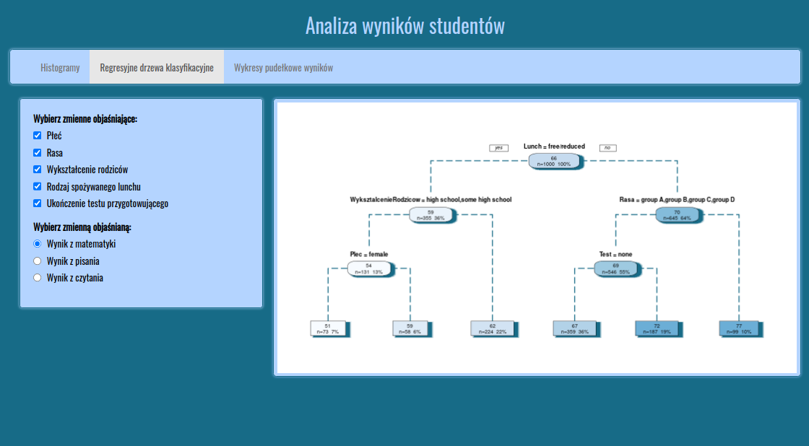

# R Shiny App for plotting regression trees

## General Info
This is an app for generating regression trees from a sample dataset, using a intuitive UI built with Shiny. It allows the user to specify the dependent and independent variables. It also creates boxplots and histograms.

## Technologies
* R version 3.6.3
* Shiny package version 1.8.0
* Rpart package version 4.1.23

## Authors
* [Maciej Jedynak](https://github.com/ThomasJNewton)
* [Mateusz Grzelik](https://github.com/matig152)
