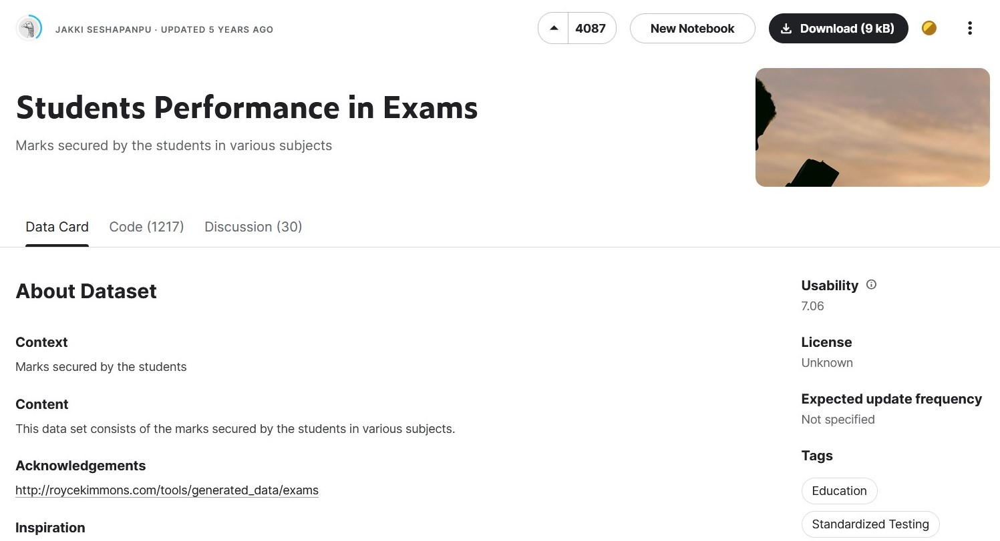
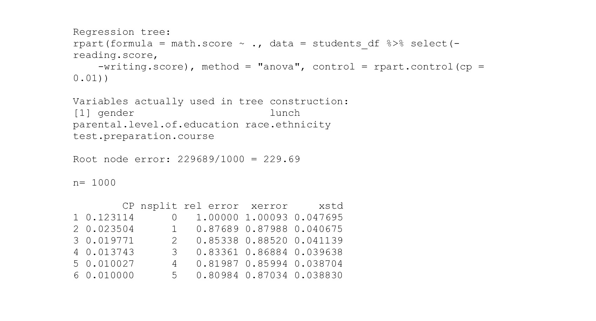
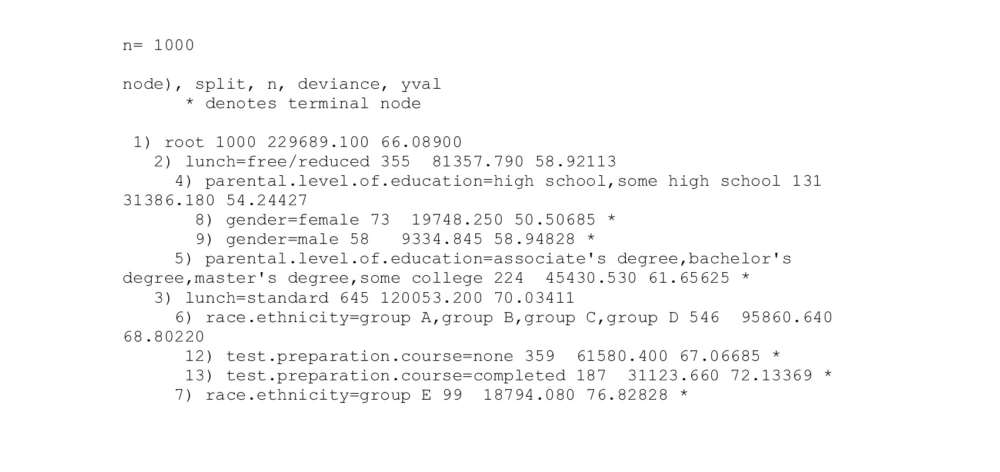
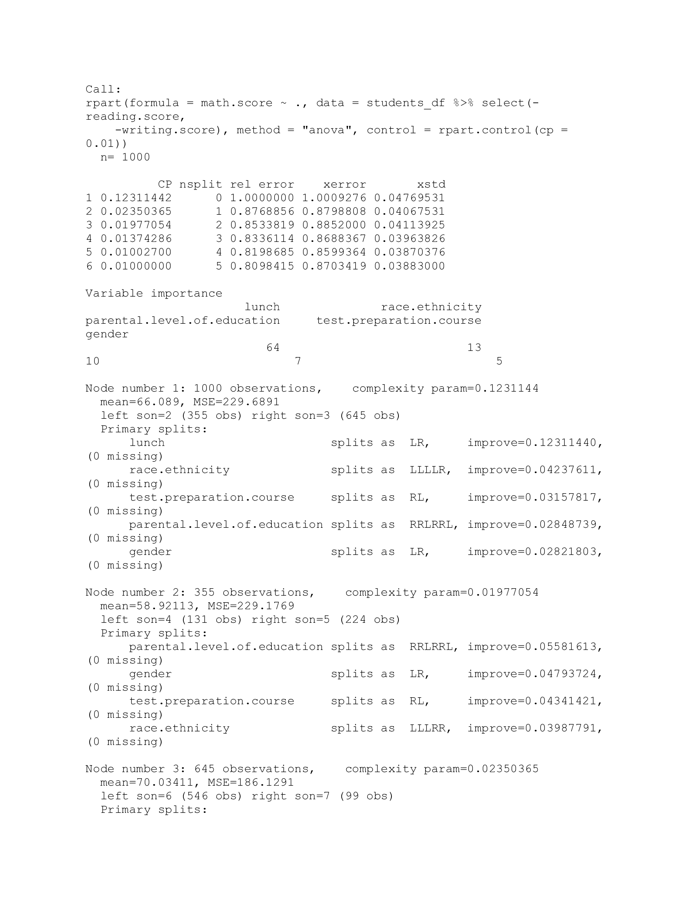
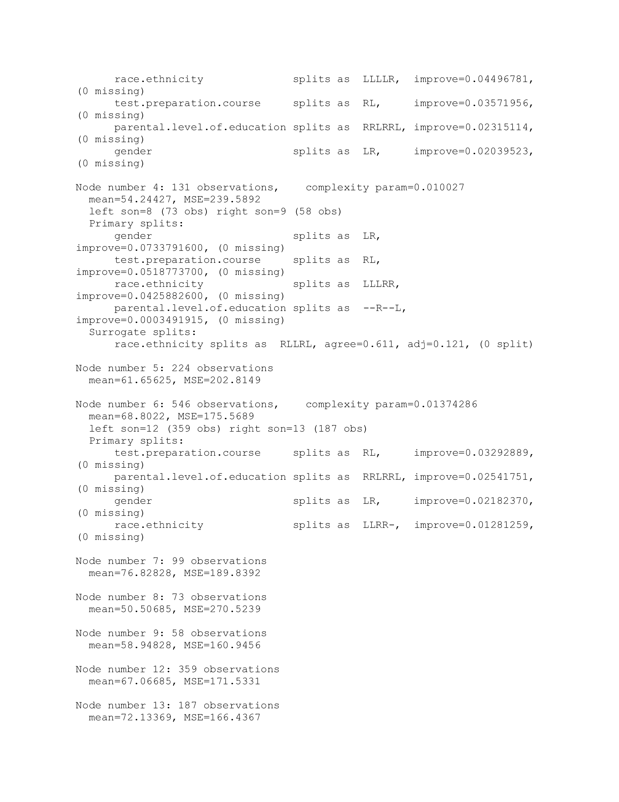

```{r, results='hide', message=FALSE, warning=FALSE, echo=FALSE}
# Potrzebne pakiety
library(rvest)
library(dplyr)
library(tidyr)
library(ggplot2)
library(geomtextpath)
library(stringr)
library(corrplot)
library(tibble)
library(psych)
library(knitr)
library(mice)
library(plotrix)
library(rpart)
library(rpart.plot)
library(moments)
library(imager)
library(fs)
```

```{r, results='hide', message=FALSE, warning=FALSE, echo=FALSE}
# Wczytanie danych i zamiana odpowiednich kolumn na factor
students_df <- read.csv("StudentsPerformance.csv")
students_df <- students_df %>% mutate_at(c('gender',
                                         'race.ethnicity',
                                         'parental.level.of.education',
                                         'lunch', 'test.preparation.course'),
                                       as.factor)
```


## Wstęp

Badany zbiór jest źródłem informacji na temat uczniów i ich ocen z róznych przedmiotów. W naszej analizie postaramy się zrozumieć oraz zobrazować relacje między wynikami studentów a ich innymi cechami.

```{r fig.align='center', out.width="443px", out.height="240px", echo=FALSE}

```


Badany zbiór danych jest fikcyjny i pochodzi ze strony *[kaggle.com](https://www.kaggle.com/datasets/spscientist/students-performance-in-exams?fbclid=IwAR2mgaWkdEd0aRKPPoUbOk2_QoRR-0uOxNsOTTieOuNIhz8MIbHpnEIpKMM)*.


## Zmienne liczbowe

Zbiór danych na jakim będziemy pracować zawiera procentowe wyniki studentów z trzech różnych egzaminów:


  - wyniki testu z matematyki (math.score),
  - wyniki testu z rozumienia tekstu czytanego (reading.score),
  - wyniki testu z pisania (writing.core).


## Zmienne liczbowe - struktura danych


Podstawowe statystyki opisowe wyników z poszczególnych egzaminów:
```{r, echo=FALSE, message=FALSE, comment=NA}
summary(students_df[6:8])
```


## Zmienne kategoryczne


Zbiór cechują także następujące zmienne kategoryczne:


  - płeć (gender),
  - rasa/przynależność etniczna (race/ethnicity),
  - wykształcenie rodziców (parental level of education),
  - rodzaj spożywanego lunchu (lunch),
  - ukończenie testu przygotowującego do egzaminów (test preparation course).


## Zmienne kategoryczne - struktura danych

```{r, echo=FALSE, message=FALSE, comment=NA}
summary(students_df[1:3])
summary(students_df[4:5])
```


## Badanie zupełności zbioru danych


```{r results='hide', message=FALSE, warning=FALSE, echo=FALSE, fig.align='center'}
md.pattern(students_df, rotate.names=TRUE)

```
Stwierdzamy, że nasz zbiór nie posiada informacyjnych braków.


## Graficzna prezentacja wyników
```{r, echo=FALSE, message=FALSE, figures-side, fig.show="hold", out.width="33%"}
## Matematyka
ggplot(students_df, aes(x=math.score)) + 
  geom_histogram(fill="lightblue",
                 color="blue",
                 bins=32) + 
  labs(title="Matematyka",
       x="Wynik w %", 
       y="Ilość") +
  theme_classic() +
  theme(plot.title = element_text(size = 30, 
                                  face = "bold", 
                                  hjust = 0.5),
        axis.title.x = element_text(size=20),
        axis.title.y = element_text(size=20),
        axis.text.x = element_text(size=20),
        axis.text.y = element_text(size=20))

## Czytanie
ggplot(students_df, aes(x=reading.score)) +
  geom_histogram(fill="lightgreen",
                 color="darkgreen",
                 bins=32) + 
  labs(title="Czytanie",
       x="Wynik w %", 
       y="Ilość") + 
  theme_classic() +
  theme(plot.title = element_text(size = 30, 
                                  face = "bold", 
                                  hjust = 0.5),
        axis.title.x = element_text(size=20),
        axis.title.y = element_text(size=20),
        axis.text.x = element_text(size=20),
        axis.text.y = element_text(size=20))

## Pisanie
ggplot(students_df, aes(x=writing.score)) + 
  geom_histogram(fill="pink",
                 color="red",
                 bins=32) + 
  labs(title="Pisanie",
       x="Wynik w %", 
       y="Ilość") +
  theme_classic() +
  theme(plot.title = element_text(size = 30, 
                                  face = "bold", 
                                  hjust = 0.5),
        axis.title.x = element_text(size=20),
        axis.title.y = element_text(size=20),
        axis.text.x = element_text(size=20),
        axis.text.y = element_text(size=20))
```

```{r, echo=FALSE, message=FALSE, fig.show="hold", out.width="33%"}
## Matematyka
ggplot(students_df, aes(x=math.score)) +
  geom_boxplot(fill="lightblue",
               color="blue") +
  labs(title="Matematyka",
       x="Wynik w %") +
  theme_classic() +
  theme(plot.title = element_text(size = 30, 
                                  face = "bold", 
                                  hjust = 0.5),
        axis.title.x = element_text(size=20),
        axis.title.y = element_text(size=20),
        axis.text.x = element_text(size=20),
        axis.text.y = element_text(size=20))

## Czytanie
ggplot(students_df, aes(x=reading.score)) +
  geom_boxplot(fill="lightgreen",
               color="darkgreen") +
  labs(title="Czytanie",
       x="Wynik w %") +
  theme_classic() +
  theme(plot.title = element_text(size = 30, 
                                  face = "bold", 
                                  hjust = 0.5),
        axis.title.x = element_text(size=20),
        axis.title.y = element_text(size=20),
        axis.text.x = element_text(size=20),
        axis.text.y = element_text(size=20))

## Pisanie
ggplot(students_df, aes(x=writing.score)) +
  geom_boxplot(fill="pink",
               color="red") +
  labs(title="Pisanie",
       x="Wynik w %") +
  theme_classic() +
  theme(plot.title = element_text(size = 30, 
                                  face = "bold", 
                                  hjust = 0.5),
        axis.title.x = element_text(size=20),
        axis.title.y = element_text(size=20),
        axis.text.x = element_text(size=20),
        axis.text.y = element_text(size=20))
```

Zauważamy, że każda ze zmiennych liczbowych posiada rozkład zbliżony do normalnego.


## Dalsza analiza rozkładów wyników


Badanie symetryczności i kurtozy:


  - rozkład wyników z matematyki - As=`r round(skewness(students_df$math.score), 3)`, Kurt.=`r round(kurtosis(students_df$math.score)-3, 3)`,
  - rozkład wyników z czytania - As=`r round(skewness(students_df$reading.score), 3)`, Kurt.=`r round(kurtosis(students_df$reading.score)-3, 3)`,
  - rozkład wyników z pisania - As=`r round(skewness(students_df$writing.score), 3)`, Kurt.=`r round(kurtosis(students_df$writing.score)-3, 3)`.

Stwierdzamy więc, że każdy rozkład jest skośny lewostronnie, posiada lewy ogon. Każdy z nich z wyjątkiem wyników z matematyki - której wykres jest leptokurtyczny - posiada rozkład platykurtyczny.

## Związki między wynikami
```{r echo=FALSE, message=FALSE, fig.align='center', out.width="420px", out.height="250px"}
# Korelacja pearsona
corr_numeric_pearson <- cor(students_df %>%
                             select_if(is.numeric),
                             method = "pearson")

corrplot.mixed(corr_numeric_pearson,
               upper="circle")
```

Na podstawie zbadania korelacji Pearsona zauważamy, że każda ze zmiennych numerycznych jest ze sobą silnie związana. Oznacza to, iż możemy się spodziewać, że uczeń, któremu idzie dobrze (źle) nauka jednego przedmiotu, osiąga także dobre (mierne) wyniki w pozostałych.


## Porównanie wyników z matematyki ze statystykami kategorycznymi


```{r echo=FALSE, message=FALSE, warning=FALSE, fig.show="hold", out.width="33%"}
# Math and gender
ggplot(students_df,
       aes(x=gender, y=math.score)) + 
  geom_boxplot(fill="lightblue") +
  labs(title="Wyniki z matematyki a płeć",
       x="Płeć",
       y="Wyniki w %") +
  theme_classic() +
  theme(plot.title = element_text(size = 25, 
                                  face = "bold", 
                                  hjust = 0.5),
        axis.title.x = element_text(size=20),
        axis.title.y = element_text(size=20),
        axis.text.x = element_text(size=20),
        axis.text.y = element_text(size=20))

# Math and test.preparation.course
ggplot(students_df,
       aes(x=test.preparation.course, y=math.score)) + 
  geom_boxplot(fill="lightblue") +
  labs(title="Wyniki z matematyki a kursy przygotowujące",
       x="Kursy przygotowujące",
       y="Wynik w %") +
  theme_classic() +
  theme(plot.title = element_text(size = 18, 
                                  face = "bold", 
                                  hjust = 0.5),
        axis.title.x = element_text(size=20),
        axis.title.y = element_text(size=20),
        axis.text.x = element_text(size=20),
        axis.text.y = element_text(size=20))

# Math and lunch
ggplot(students_df,
       aes(x=lunch, y=math.score)) + 
  geom_boxplot(fill="lightblue") +
  labs(title="Wyniki z matematyki a lunch",
       x="Lunch",
       y="Wynik w %") +
  theme_classic() +
  theme(plot.title = element_text(size = 20, 
                                  face = "bold", 
                                  hjust = 0.5),
        axis.title.x = element_text(size=20),
        axis.title.y = element_text(size=20),
        axis.text.x = element_text(size=20),
        axis.text.y = element_text(size=20))
```

```{r echo=FALSE, message=FALSE, warning=FALSE, fig.show="hold", out.width="50%"}
# Math and parental.level.of.education
ggplot(students_df,
       aes(x=parental.level.of.education, y=math.score)) + 
  geom_boxplot(fill="lightblue") +
  labs(title="Wyniki z matematyki a poziom wykształcenia rodziców",
       x="Poziom wykształcenia rodziców",
       y="Wynik w %") +
  theme_classic() +
  theme(plot.title = element_text(size = 18, 
                                  face = "bold", 
                                  hjust = 0.5),
        axis.title.x = element_text(size=20),
        axis.title.y = element_text(size=20),
        axis.text.x = element_text(size=10,
                                   angle=45,
                                   vjust=0.5,
                                   hjust=0.5),
        axis.text.y = element_text(size=20))

# Math and race/ethnicity
ggplot(students_df,
       aes(x=race.ethnicity, y=math.score)) + 
  geom_boxplot(fill="lightblue") +
  labs(title="Wyniki z matematyki a rasa/tożsamość etniczna",
       x="Rasa/tożsamość etniczna",
       y="Wynik w %") +
  theme_classic() +
  theme(plot.title = element_text(size = 20, 
                                  face = "bold", 
                                  hjust = 0.5),
        axis.title.x = element_text(size=20),
        axis.title.y = element_text(size=20),
        axis.text.x = element_text(size=20),
        axis.text.y = element_text(size=20))
```


## Porównanie wyników z czytania ze statystykami kategorycznymi


```{r echo=FALSE, message=FALSE, warning=FALSE, fig.show="hold", out.width="33%"}
# Reading and gender
ggplot(students_df,
       aes(x=gender, y=reading.score)) + 
  geom_boxplot(fill="lightgreen") +
  labs(title="Wyniki z czytania a płeć",
       x="Płeć",
       y="Wyniki w %") +
  theme_classic() +
  theme(plot.title = element_text(size = 25, 
                                  face = "bold", 
                                  hjust = 0.5),
        axis.title.x = element_text(size=20),
        axis.title.y = element_text(size=20),
        axis.text.x = element_text(size=20),
        axis.text.y = element_text(size=20))

# Reading and test.preparation.course
ggplot(students_df,
       aes(x=test.preparation.course, y=reading.score)) + 
  geom_boxplot(fill="lightgreen") +
  labs(title="Wyniki z czytania a kursy przygotowujące",
       x="Kursy przygotowujące",
       y="Wynik w %") +
  theme_classic() +
  theme(plot.title = element_text(size = 18, 
                                  face = "bold", 
                                  hjust = 0.5),
        axis.title.x = element_text(size=20),
        axis.title.y = element_text(size=20),
        axis.text.x = element_text(size=20),
        axis.text.y = element_text(size=20))

# Reading and lunch
ggplot(students_df,
       aes(x=lunch, y=reading.score)) + 
  geom_boxplot(fill="lightgreen") +
  labs(title="Wyniki z czytania a lunch",
       x="Lunch",
       y="Wynik w %") +
  theme_classic() +
  theme(plot.title = element_text(size = 20, 
                                  face = "bold", 
                                  hjust = 0.5),
        axis.title.x = element_text(size=20),
        axis.title.y = element_text(size=20),
        axis.text.x = element_text(size=20),
        axis.text.y = element_text(size=20))
```

```{r echo=FALSE, message=FALSE, warning=FALSE, fig.show="hold", out.width="50%"}
# Reading and parental.level.of.education
ggplot(students_df,
       aes(x=parental.level.of.education, y=reading.score)) + 
  geom_boxplot(fill="lightgreen") +
  labs(title="Wyniki z czytania a poziom wykształcenia rodziców",
       x="Poziom wykształcenia rodziców",
       y="Wynik w %") +
  theme_classic() +
  theme(plot.title = element_text(size = 18, 
                                  face = "bold", 
                                  hjust = 0.5),
        axis.title.x = element_text(size=20),
        axis.title.y = element_text(size=20),
        axis.text.x = element_text(size=10,
                                   angle=45,
                                   vjust=0.5,
                                   hjust=0.5),
        axis.text.y = element_text(size=20))

# Reading and race/ethnicity
ggplot(students_df,
       aes(x=race.ethnicity, y=reading.score)) + 
  geom_boxplot(fill="lightgreen") +
  labs(title="Wyniki z czytania a rasa/tożsamość etniczna",
       x="Rasa/tożsamość etniczna",
       y="Wynik w %") +
  theme_classic() +
  theme(plot.title = element_text(size = 20, 
                                  face = "bold", 
                                  hjust = 0.5),
        axis.title.x = element_text(size=20),
        axis.title.y = element_text(size=20),
        axis.text.x = element_text(size=20),
        axis.text.y = element_text(size=20))
```


## Porównanie wyników z pisania ze statystykami kategorycznymi


```{r echo=FALSE, message=FALSE, warning=FALSE, fig.show="hold", out.width="33%"}
# Writing and gender
ggplot(students_df,
       aes(x=gender, y=writing.score)) + 
  geom_boxplot(fill="pink") +
  labs(title="Wyniki z pisania a płeć",
       x="Płeć",
       y="Wyniki w %") +
  theme_classic() +
  theme(plot.title = element_text(size = 25, 
                                  face = "bold", 
                                  hjust = 0.5),
        axis.title.x = element_text(size=20),
        axis.title.y = element_text(size=20),
        axis.text.x = element_text(size=20),
        axis.text.y = element_text(size=20))

# Writing and test.preparation.course
ggplot(students_df,
       aes(x=test.preparation.course, y=writing.score)) + 
  geom_boxplot(fill="pink") +
  labs(title="Wyniki z pisania a kursy przygotowujące",
       x="Kursy przygotowujące",
       y="Wynik w %") +
  theme_classic() +
  theme(plot.title = element_text(size = 18, 
                                  face = "bold", 
                                  hjust = 0.5),
        axis.title.x = element_text(size=20),
        axis.title.y = element_text(size=20),
        axis.text.x = element_text(size=20),
        axis.text.y = element_text(size=20))

# Writing and lunch
ggplot(students_df,
       aes(x=lunch, y=writing.score)) + 
  geom_boxplot(fill="pink") +
  labs(title="Wyniki z pisania a lunch",
       x="Lunch",
       y="Wynik w %") +
  theme_classic() +
  theme(plot.title = element_text(size = 20, 
                                  face = "bold", 
                                  hjust = 0.5),
        axis.title.x = element_text(size=20),
        axis.title.y = element_text(size=20),
        axis.text.x = element_text(size=20),
        axis.text.y = element_text(size=20))
```

```{r echo=FALSE, message=FALSE, warning=FALSE, fig.show="hold", out.width="50%"}
# Writing and parental.level.of.education
ggplot(students_df,
       aes(x=parental.level.of.education, y=writing.score)) + 
  geom_boxplot(fill="pink") +
  labs(title="Wyniki z pisania a poziom wykształcenia rodziców",
       x="Poziom wykształcenia rodziców",
       y="Wynik w %") +
  theme_classic() +
  theme(plot.title = element_text(size = 18, 
                                  face = "bold", 
                                  hjust = 0.5),
        axis.title.x = element_text(size=20),
        axis.title.y = element_text(size=20),
        axis.text.x = element_text(size=10,
                                   angle=45,
                                   vjust=0.5,
                                   hjust=0.5),
        axis.text.y = element_text(size=20))

# Writing and race/ethnicity
ggplot(students_df,
       aes(x=race.ethnicity, y=writing.score)) + 
  geom_boxplot(fill="pink") +
  labs(title="Wyniki z pisania a rasa/tożsamość etniczna",
       x="Rasa/tożsamość etniczna",
       y="Wynik w %") +
  theme_classic() +
  theme(plot.title = element_text(size = 20, 
                                  face = "bold", 
                                  hjust = 0.5),
        axis.title.x = element_text(size=20),
        axis.title.y = element_text(size=20),
        axis.text.x = element_text(size=20),
        axis.text.y = element_text(size=20))
```


## Wnioski dotyczące porównania wyników z cechami 


Przeciętnie, najlepsze oceny z matematyki otrzymali chłopcy, jednak z czytania i pisania lepiej poradziły sobie dziewczynki. Ponadto, dzieci, które zjadały pełen lunch, także osiągały przeciętnie lepsze wyniki niż te, jedzące darmowy lub pomniejszony. Najlepiej we wszystkich testach wypadły dzieci rodziców z wykształceniem wyższym na poziomie magistra. Przeciętnie też, lepiej wypadają dzieci, które przeszły przez kurs przygotowujący.
W każdym przypadku grupa E przeciętnie wypadła najlepiej, zaś grupa A najgorzej.


## Drzewa klasyfikacyjne i regresyjne


Jak podaje strona *[Pogotowia Statystycznego](https://www.statsoft.pl/textbook/stathome_stat.html?https%3A%2F%2Fwww.statsoft.pl%2Ftextbook%2Fstcart.html)*:

> "Modele drzew klasyfikacyjnych i regresyjnych (Classification and Regression Trees - C&RT) umożliwia [*sic!*] zarówno budowę modeli służących do rozwiązywania problemów regresyjnych (gdzie zmienną zależną jest cecha ilościową) jak i klasyfikacyjnych (jakościowa zmienna zależna)."

W naszym projekcie postaramy się wytłumaczyć wyniki z poszczególnych przedmiotów za pomocą danych kategorycznych.


## Wstępny opis i uzasadnienie


Z drzew klasyfikacyjnych i regresyjnych (ang. classification and regression trees - CART). Korzystamy w sytuacji kiedy zależność między zmiennymi objaśniającymi i objaśnianymi nie jest liniowa, a raczej niezwykle skomplikowana. Drzewa decyzyjne korzystają z tzw. predyktorów, mają one za zadanie przewidywać wartości zmiennej, którą staramy się opisać za ich pomocą. Każdy kolejny węzęł w powstałym drzewie stanowi najważniejszy (najistotniejszy, pozwala przewidzieć w najogólniej) sposób podziału danych w rozważanym zakresie. Liście drzewa zawierają informacje o przeciętnych wynikach w grupie spełniającej wszystkie warunki umieszczone na ścieżce do korzenia.


## Metoda

1. Rekurencyjnie rozbijamy dane na mniejsze kategorie, by stworzyć duże drzewo. W tym celu wybieramy punkt dla predyktora, w którym RSS (Residual Standard Error) będzie najmnejszy. W tym punkcie dzielimy dane na dwa zbiory i postępujemy tak do momentu, aż każdy zbiór będzie miał pewną ustaloną minimalną ilość elementów.

2. Stosujemy ocenę złożoności w celu zmniejszenia lub przystrzyżenia uzyskanego dużego drzewa, jako funkcję α. W tym celu dla każdego drzewa z T liśćmi szukamy tego, które minimalizuje RSS + α(T).

3. Możemy zastosować sprawdzian krzyżowy (k-fold cross validation) w celu znalezienia wartości α, która minimalizuje błąd testowy.

4. Wybieramy ostateczny model.


## Przykładowe drzewo klasyfikacyjne


Poniżej znajduje się drzewo klasyfikacyjne, w którym tłumaczymy wyniki testów z matematyki za pomocą wszystkich zmiennych kategorycznych.

```{r echo=FALSE, fig.align='center'}
tree <- rpart(math.score~.,
              method="anova",
              data=students_df %>% 
                select(-reading.score, -writing.score),
              control=rpart.control(cp=.01))
#identify best cp value to use
best_cp <- tree$cptable[which.min(tree$cptable[,"xerror"]),"CP"]
#produce a pruned tree based on the best cp value
pruned_tree <- prune(tree, cp=best_cp)
#plot the pruned tree
prp(pruned_tree,
    faclen=0,
    extra=1,
    roundint=FALSE,
    digits=4)
```


## Informacje na temat drzewa cd.
```{r comment=NA, results='hide'}
printcp(tree)
```
```{r fig.align='center', echo=FALSE}

```


## Informacje na temat drzewa cd.
```{r comment=NA, results='hide'}
print(tree)
```
```{r fig.align='center', echo=FALSE}

```

## Informacje na temat drzewa cd. {.flexbox .vcenter}
```{r comment=NA, results='hide'}
summary(tree)
```
<div class="columns-2" style="width: 800px;">

###
{height=500px, width=350px}


###
{height=500px, width=350px}


## Bibliografia


1. https://www.kaggle.com/datasets/spscientist/students-performance-in-exams?fbclid=IwAR2mgaWkdEd0aRKPPoUbOk2_QoRR-0uOxNsOTTieOuNIhz8MIbHpnEIpKMM
2. https://www.statsoft.pl/textbook/stathome_stat.html?https%3A%2F%2Fwww.statsoft.pl%2Ftextbook%2Fstcart.html
3. https://www.statology.org/classification-and-regression-trees-in-r/
4. https://www.statology.org/classification-and-regression-trees/
5. https://www.statology.org/k-fold-cross-validation/


